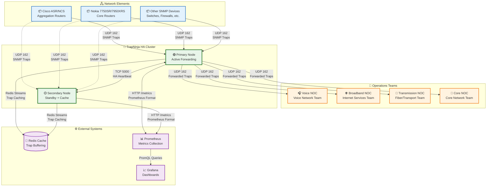
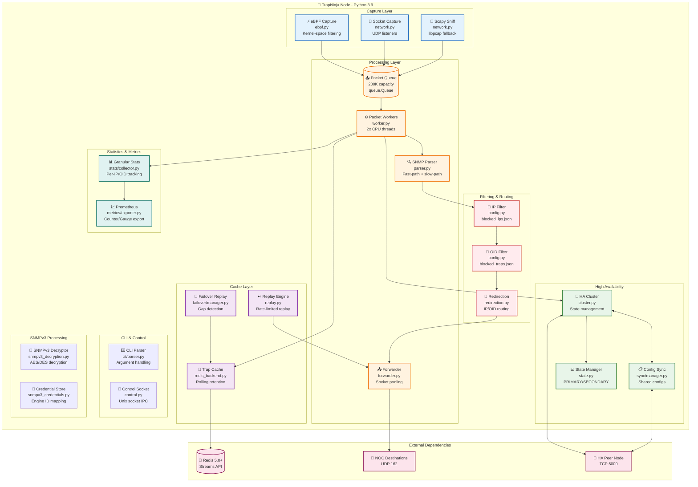
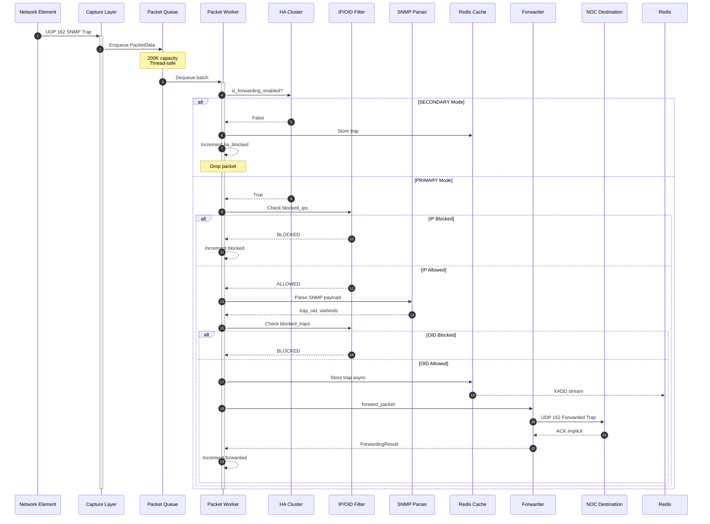
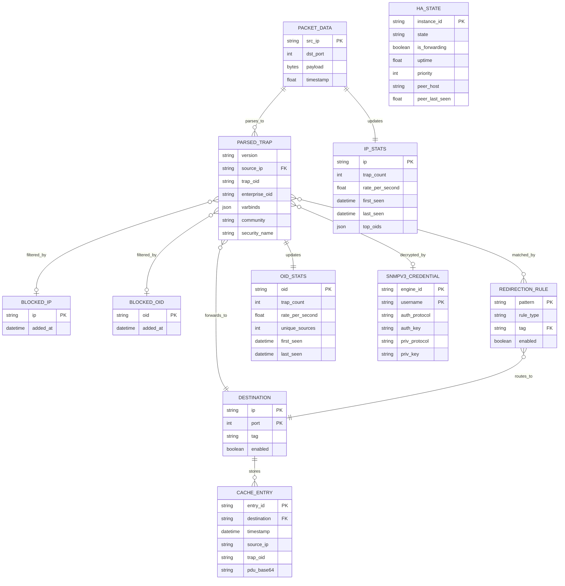
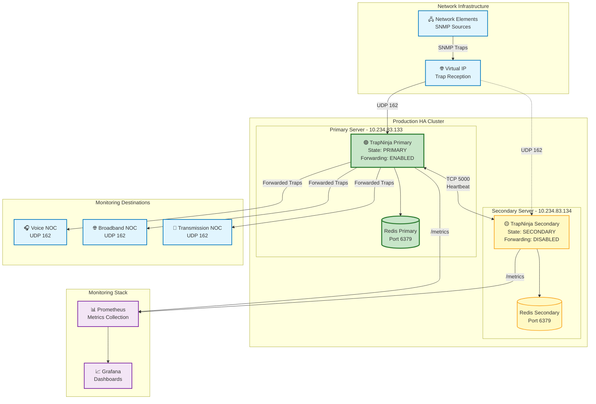

# TrapNinja Architecture

**Version:** 0.8.0
**Last Updated:** February 2026

---

## Table of Contents

- [Overview](#overview)
- [Problem Statement & Business Context](#problem-statement--business-context)
- [C4 System Context Diagram](#c4-system-context-diagram)
- [C4 Container Diagram](#c4-container-diagram)
- [Request Flow Sequence](#request-flow-sequence)
- [Technology Stack](#technology-stack)
- [Data Flow](#data-flow)
- [HA Architecture](#ha-architecture)
- [Config Synchronisation](#config-synchronisation)
- [Capture Mode Selection](#capture-mode-selection)
- [Data Model](#data-model)
- [Directory Structure](#directory-structure)
- [Module Responsibilities](#module-responsibilities)
- [Deployment Model](#deployment-model)
- [Key Design Decisions](#key-design-decisions)
- [Performance Targets](#performance-targets)
- [Deployment Architecture](#deployment-architecture)
- [System Requirements](#system-requirements)
- [API / CLI Reference Summary](#api--cli-reference-summary)
- [Constants Reference](#constants-reference)
- [Related Documentation](#related-documentation)

---

## Overview

TrapNinja is a high-performance SNMP trap forwarding system designed for telecommunications environments requiring 99.999% availability. The system captures SNMP traps from multi-vendor network equipment and intelligently routes them to specialized Network Operations Centers (NOCs) based on configurable rules.

**Primary Users:** Network Operations Teams (Voice NOC, Broadband NOC, Transmission NOC, Core Network Team)

**Key Capabilities:**
- High-throughput packet processing (10,000+ traps/second sustained, 100,000+ burst)
- Primary/Secondary high-availability with sub-3-second automatic failover
- Service-based routing to specialized NOCs by IP or OID patterns
- Zero trap loss during monitoring system outages via Redis-based caching and replay
- SNMPv3 decryption and conversion to SNMPv2c
- Prometheus-compatible metrics for comprehensive monitoring

---

## Problem Statement & Business Context

### Problem Statement

Telecommunications networks generate thousands of SNMP traps per second from diverse equipment including Cisco ASR/NCS routers and Nokia 7750SR/7950XRS systems. Traditional trap forwarding solutions lack the performance, resilience, and intelligent routing capabilities needed for modern carrier-grade operations. Specifically:

1. **Performance bottlenecks** during network events like fiber cuts cause trap floods of 10,000-100,000+ traps that overwhelm traditional forwarders
2. **Single points of failure** in trap forwarding paths result in missed alarms during critical network events
3. **Lack of intelligent routing** forces all NOC teams to receive all traps, creating alert fatigue
4. **Monitoring outages** cause permanent trap loss with no ability to backfill historical data
5. **SNMPv3 encrypted traps** cannot be processed by legacy monitoring systems

### Business Context

- **Primary Users:** Voice NOC, Broadband NOC, Transmission Team, Core Network Operations
- **Use Cases:**
  - Real-time forwarding of SNMP traps to multiple monitoring destinations
  - Service-based routing of traps to specialized NOC teams
  - Blocking noisy or irrelevant trap sources at the forwarder level
  - Replaying cached traps during monitoring system outages
  - Decrypting SNMPv3 traps for legacy monitoring system compatibility
- **Non-Functional Requirements:**
  - **Availability:** 99.999% uptime (5 nines) with automatic failover
  - **Performance:** 10,000+ traps/second sustained, 100,000+ burst handling
  - **Latency:** Sub-millisecond forwarding latency
  - **Scalability:** Horizontal scaling via additional HA pairs
  - **Security:** SNMPv3 decryption, credential management, no trap data persistence beyond cache window
- **Integration Points:** Network Elements (Cisco, Nokia, etc.), NOC Monitoring Systems, Prometheus/Grafana, Redis Cache

---

## C4 System Context Diagram



---

## C4 Container Diagram



### Container Diagram Explanation

TrapNinja is implemented as a Python 3.9 application with modular architecture for maintainability and performance. The system is organized into distinct layers:

**Capture Layer:** Three capture methods with automatic fallback hierarchy. eBPF provides kernel-space filtering for maximum performance (30k+ traps/sec), Socket capture uses UDP listeners for standard operation (10k+ traps/sec), and Scapy Sniff provides libpcap-based fallback for compatibility (5k+ traps/sec). Only ONE capture method runs at a time to prevent packet duplication.

**Processing Layer:** A thread-safe queue with 200,000 packet capacity buffers incoming traps for processing by worker threads (2x CPU cores, up to 32). The SNMP parser implements a fast-path for SNMPv2c (direct byte scanning) and slow-path for SNMPv1/complex packets. The forwarder uses socket pooling for efficient connection reuse.

**Filtering & Routing Layer:** Configuration-driven filtering blocks unwanted IPs and OIDs. The redirection engine routes traps to specialized destinations based on source IP or trap OID patterns, enabling service-based routing to different NOC teams.

**High Availability Layer:** The HA Cluster manages PRIMARY/SECONDARY state with automatic failover. Config Sync ensures shared configurations remain synchronized between nodes. The state machine handles transitions with split-brain detection and resolution.

**Cache Layer:** Redis Streams-based trap caching with configurable retention (default 2 hours) enables replay during monitoring outages. The Failover Replay system automatically detects gaps during HA transitions and replays missed traps.

**Statistics & Metrics Layer:** Granular statistics track per-IP, per-OID, and per-destination metrics. Prometheus-format metrics are exported for integration with monitoring dashboards.

**SNMPv3 Layer:** Decryption engine handles AES/DES encrypted SNMPv3 traps, converting them to SNMPv2c for legacy system compatibility. Credential store manages engine ID to user mappings.

---

## Request Flow Sequence



---

## Technology Stack

**Runtime & Languages:**
- Python 3.9 (with `-O` optimization flag for production)
- Scapy 2.5+ (packet capture and parsing)
- BCC/eBPF (kernel-space packet acceleration on Linux 4.4+)

**Data Storage:**
- Redis 5.0.3+ (Streams API for trap caching)
- JSON files (configuration persistence)

**Infrastructure:**
- RHEL 8.x / CentOS 8 / Rocky Linux 8 (production OS)
- systemd (service management)
- Ansible (deployment automation)

**Networking:**
- Raw sockets (high-performance forwarding)
- UDP port 162 (SNMP trap reception)
- TCP port 5000 (HA heartbeat)

**Monitoring & Security:**
- Prometheus (metrics export)
- HMAC-SHA256 (HA message authentication)
- SNMPv3 AES/DES decryption (pysnmp, cryptography)

---

## Data Flow

```
┌───────────────────────────────────────────────────────────────────────────┐
│                              CAPTURE LAYER                                 │
│   ┌─────────┐    ┌─────────┐    ┌─────────┐                               │
│   │ eBPF    │    │ Socket  │    │ Scapy   │                               │
│   │ Capture │    │ Capture │    │ Sniff   │                               │
│   └────┬────┘    └────┬────┘    └────┬────┘                               │
│        └──────────────┼──────────────┘                                    │
│               (Only ONE method active)                                     │
└───────────────────────┼───────────────────────────────────────────────────┘
                        │
                        ▼
┌───────────────────────────────────────────────────────────────────────────┐
│                         PACKET QUEUE (200K capacity)                       │
└───────────────────────────────────────────────────────────────────────────┘
                        │
                        ▼
┌───────────────────────────────────────────────────────────────────────────┐
│                      PROCESSING WORKERS (2x CPU cores)                     │
│                                                                            │
│   ┌─────────────────────────────────────────────────────────────────┐     │
│   │  1. HA Check (is_forwarding_enabled)                            │     │
│   │     └─► If SECONDARY: cache trap, increment ha_blocked, SKIP    │     │
│   │                                                                  │     │
│   │  2. IP Block Check                                               │     │
│   │     └─► If blocked_ip: DROP or redirect to blocked_dest         │     │
│   │                                                                  │     │
│   │  3. SNMP Parse (fast path first, slow path fallback)            │     │
│   │                                                                  │     │
│   │  4. OID Block/Redirect Check                                     │     │
│   │     └─► Apply redirection rules if matched                       │     │
│   │                                                                  │     │
│   │  5. Determine Destinations                                       │     │
│   │                                                                  │     │
│   │  6. Update Granular Statistics (per-IP, per-OID)                │     │
│   └─────────────────────────────────────────────────────────────────┘     │
└───────────────────────────────────────────────────────────────────────────┘
                        │
          ┌─────────────┼─────────────┐
          ▼             ▼             ▼
┌──────────────┐ ┌──────────────┐ ┌──────────────┐
│ Redis Cache  │ │  Forwarding  │ │  Statistics  │
│ (if enabled) │ │    Layer     │ │   Export     │
└──────────────┘ └──────┬───────┘ └──────────────┘
                        │
                        ▼
┌───────────────────────────────────────────────────────────────────────────┐
│                          FORWARDING LAYER                                  │
│                                                                            │
│   forward_packet() - Single forwarding function                            │
│   Source Port: FORWARD_SOURCE_PORT (10162) - prevents re-capture          │
│                                                                            │
│   ┌──────────────┐  ┌──────────────┐  ┌──────────────┐                    │
│   │ Destination 1│  │ Destination 2│  │ Destination N│                    │
│   │  Raw Socket  │  │  Raw Socket  │  │  Raw Socket  │                    │
│   └──────────────┘  └──────────────┘  └──────────────┘                    │
└───────────────────────────────────────────────────────────────────────────┘
```

---

## HA Architecture

```
   Primary Node                    Secondary Node
   ┌─────────────────┐            ┌─────────────────┐
   │    TrapNinja    │◄──────────►│    TrapNinja    │
   │    (ACTIVE)     │  Heartbeat │    (STANDBY)    │
   │                 │  (TCP/UDP) │                 │
   │  is_forwarding  │            │  is_forwarding  │
   │     = True      │            │     = False     │
   │                 │            │                 │
   │  Config Sync ──────────────────► Pull configs  │
   │  (push changes) │            │  on startup     │
   └────────┬────────┘            └────────┬────────┘
            │                              │
            ▼                              ▼
      Forwards Traps               Caches Traps
     to Destinations              (for failover replay)
```

### HA States

| State | `is_forwarding_enabled()` | Behavior |
|-------|--------------------------|----------|
| PRIMARY | True | Forwards all traps, pushes config changes |
| SECONDARY | False | Caches traps, pulls configs, monitors primary |
| STANDALONE | True | No HA, forwards all traps |
| INITIALIZING | False | Starting up, no forwarding |
| FAILOVER | True (transitioning) | Becoming PRIMARY |
| SPLIT_BRAIN | False | Both nodes detected as primary |
| ERROR | False | Error state, no forwarding |

---

## Config Synchronisation

**Shared configs** (synced between nodes):
- `destinations.json`
- `blocked_ips.json`
- `blocked_traps.json`
- `redirected_*.json`

**Local configs** (not synced):
- `ha_config.json`
- `cache_config.json`
- `stats_config.json`
- `listen_ports.json`

---

## Capture Mode Selection

TrapNinja supports three capture modes, tried in order:

1. **eBPF** (highest performance): Kernel-space filtering
   - Requires: root, BCC library, kernel 4.4+
   - Performance: 30k+ traps/sec, ~20% CPU

2. **Socket** (standard): UDP socket listeners
   - Requires: port binding capability
   - Performance: 10k+ traps/sec, ~40% CPU

3. **Sniff** (fallback): Scapy packet capture
   - Requires: raw socket capability (usually root)
   - Performance: 5k+ traps/sec, ~60% CPU

### Critical: Single Capture Method

Only ONE capture method runs at a time. Running multiple methods simultaneously causes packet duplication.

```python
# In service.py - capture mode selection
if capture_mode == "ebpf" and ebpf_available():
    start_ebpf_capture()  # ONLY eBPF
elif capture_mode == "socket":
    start_all_udp_listeners()  # ONLY socket
elif capture_mode == "sniff":
    cleanup_udp_sockets()  # Ensure no sockets running
    start_sniff()  # ONLY sniff
```

---

## Data Model



**Data Flow Explanation:**

1. **PACKET_DATA** represents raw captured packets queued for processing
2. **PARSED_TRAP** contains extracted SNMP information after parsing
3. **DESTINATION** defines forwarding targets, loaded from `destinations.json`
4. **BLOCKED_IP/BLOCKED_OID** filter unwanted traffic at processing time
5. **REDIRECTION_RULE** maps IP/OID patterns to destination tags for service-based routing
6. **CACHE_ENTRY** stores traps in Redis Streams for replay capability
7. **HA_STATE** tracks cluster state for coordinated failover
8. **IP_STATS/OID_STATS** collect granular metrics for monitoring dashboards
9. **SNMPV3_CREDENTIAL** stores decryption credentials per engine ID

---

## Directory Structure

### Repository Layout

```
trapninja/
├── src/                              # DEPLOYABLE CODE
│   ├── trapninja.py                  # Main entry point
│   ├── VERSION                       # Version file (read by code)
│   ├── trapninja/                    # Python package (18 top-level modules)
│   │   ├── __init__.py               # Package exports
│   │   ├── __version__.py            # Reads VERSION file, feature flags
│   │   ├── main.py                   # CLI entry point
│   │   ├── service.py                # Main service orchestration
│   │   ├── config.py                 # Configuration loading
│   │   ├── daemon.py                 # Daemon management
│   │   ├── network.py                # Network/UDP listener logic
│   │   ├── ebpf.py                   # eBPF acceleration module
│   │   ├── shadow.py                 # Shadow/mirror mode logic
│   │   ├── control.py                # Unix socket control interface
│   │   ├── control_handlers.py       # Extracted control socket handlers
│   │   ├── security.py               # Security utilities
│   │   ├── logger.py                 # Logging configuration
│   │   ├── redirection.py            # IP/OID redirection
│   │   ├── diagnostics.py            # System diagnostics
│   │   ├── snmpv3_decryption.py      # SNMPv3 decryption engine
│   │   ├── snmpv3_credentials.py     # SNMPv3 credential management
│   │   │
│   │   ├── cache/                    # Redis caching (6 files)
│   │   │   ├── __init__.py
│   │   │   ├── redis_backend.py      # TrapCache, RetentionManager
│   │   │   ├── replay.py             # ReplayEngine
│   │   │   └── failover/             # Failover replay
│   │   │       ├── __init__.py
│   │   │       ├── detector.py       # GapDetector
│   │   │       ├── manager.py        # FailoverReplayManager
│   │   │       └── tracker.py        # FailoverTracker
│   │   │
│   │   ├── cli/                      # CLI command modules (18 files)
│   │   │   ├── __init__.py
│   │   │   ├── command_base.py       # Generic config managers
│   │   │   ├── registry.py           # Declarative command registry
│   │   │   ├── config_commands.py    # Config subcommand
│   │   │   ├── parser.py             # Argument parsing
│   │   │   ├── validation.py         # Input validation
│   │   │   ├── executor.py           # Command dispatch
│   │   │   ├── output.py             # Output formatting
│   │   │   ├── daemon_commands.py    # Service lifecycle
│   │   │   ├── filtering_commands.py # IP/OID block/unblock
│   │   │   ├── ha_commands.py        # HA status/promote/demote
│   │   │   ├── cache_commands.py     # Cache query/replay/clear
│   │   │   ├── stats_commands.py     # Statistics display
│   │   │   ├── shadow_commands.py    # Shadow mode
│   │   │   ├── snmpv3_commands.py    # SNMPv3 credentials
│   │   │   ├── sync_commands.py      # Config sync
│   │   │   ├── failover_commands.py  # Failover replay
│   │   │   └── metrics_commands.py   # Metrics display
│   │   │
│   │   ├── core/                     # Types, constants, exceptions (8 files)
│   │   │   ├── __init__.py
│   │   │   ├── constants.py          # FORWARD_SOURCE_PORT, etc.
│   │   │   ├── exceptions.py         # TrapNinjaError, etc.
│   │   │   ├── types.py              # PacketData, Destination, etc.
│   │   │   ├── optional_modules.py   # Lazy-loading module registry
│   │   │   ├── service_init.py       # 15-phase service initializer
│   │   │   ├── capture.py            # Capture mode handling
│   │   │   └── fragmentation.py      # Packet fragmentation
│   │   │
│   │   ├── ha/                       # High Availability (9 files)
│   │   │   ├── __init__.py
│   │   │   ├── api.py                # Public HA API
│   │   │   ├── cluster.py            # HACluster implementation
│   │   │   ├── config.py             # HAConfig dataclass
│   │   │   ├── messages.py           # HAMessage types
│   │   │   ├── state.py              # HAState enum
│   │   │   └── sync/                 # Config synchronisation
│   │   │       ├── __init__.py
│   │   │       ├── config_bundle.py  # SharedConfig types
│   │   │       └── manager.py        # ConfigSyncManager
│   │   │
│   │   ├── metrics/                  # Prometheus metrics (4 files)
│   │   │   ├── __init__.py
│   │   │   ├── collector.py          # Metrics collection
│   │   │   ├── config.py             # Metrics configuration
│   │   │   └── exporter.py           # Prometheus HTTP export
│   │   │
│   │   ├── processing/               # Packet processing (7 files)
│   │   │   ├── __init__.py
│   │   │   ├── parser.py             # Fast SNMP parsing
│   │   │   ├── forwarder.py          # Packet forwarding + SocketPool
│   │   │   ├── worker.py             # Processing workers
│   │   │   ├── stats.py              # Processing statistics
│   │   │   ├── config_cache.py       # Configuration caching
│   │   │   └── packet_handler.py     # Refactored packet handling
│   │   │
│   │   └── stats/                    # Statistics collection (4 files)
│   │       ├── __init__.py
│   │       ├── collector.py          # GranularStatsCollector
│   │       ├── models.py             # IPStats, OIDStats, etc.
│   │       └── api.py                # Query API
│   │
│   └── config/                       # Configuration files (16 files)
│       ├── trapninja.json
│       ├── destinations.json
│       ├── blocked_ips.json
│       ├── blocked_traps.json
│       ├── redirected_ips.json
│       ├── redirected_oids.json
│       ├── redirected_destinations.json
│       ├── ha_config.json
│       ├── cache_config.json
│       ├── capture_config.json
│       ├── shadow_config.json
│       ├── stats_config.json
│       ├── sync_config.json
│       ├── listen_ports.json
│       ├── ha_config_primary_example.json
│       └── ha_config_secondary_example.json
│
├── dev/                              # DEVELOPMENT FILES (not deployed)
│   ├── CHANGELOG.md
│   ├── requirements.txt
│   ├── requirements-minimal.txt
│   ├── scripts/                      # Build/install scripts
│   ├── tests/                        # Test suite
│   └── tools/                        # Development tools
│
├── docs/                             # DOCUMENTATION (not deployed)
│
├── ansible/                          # DEPLOYMENT AUTOMATION
│   ├── deploy.yml                    # Main playbook
│   └── templates/                    # Jinja2 templates
│
├── config.example/                   # EXAMPLE CONFIGURATIONS
│
├── pyproject.toml                    # Python packaging (pip install)
├── pytest.ini                        # Test configuration
├── MANIFEST.in                       # Package manifest
├── README.md
├── LICENSE
└── .gitignore
```

### Package Summary

| Package | Files | Purpose |
|---------|-------|---------|
| `cache/` | 6 | Redis-based trap caching with failover replay |
| `cli/` | 18 | Command-line interface modules |
| `core/` | 8 | Shared constants, types, exceptions, optional module registry |
| `ha/` | 9 | High availability with config sync |
| `metrics/` | 4 | Prometheus-compatible metrics collection and export |
| `processing/` | 7 | High-performance packet processing pipeline |
| `stats/` | 4 | Granular per-IP/OID statistics |

---

## Module Responsibilities

### Top-Level Modules

| Module | Responsibility |
|--------|---------------|
| `config.py` | Load/save configuration, define paths and constants |
| `daemon.py` | Process daemonization, PID management, subprocess spawning |
| `service.py` | Main service loop, component initialization, capture mode selection |
| `network.py` | UDP listeners, packet queue (200K capacity), Scapy capture integration |
| `ebpf.py` | eBPF kernel-space packet acceleration |
| `shadow.py` | Shadow/mirror mode for parallel testing without forwarding |
| `redirection.py` | IP and OID-based trap routing to alternate destinations |
| `control.py` | Unix socket server for CLI communication |
| `control_handlers.py` | Extracted handler functions for control socket commands |
| `security.py` | Security utilities and input sanitisation |
| `diagnostics.py` | System health checks and diagnostic commands |
| `logger.py` | Logging configuration |
| `snmpv3_credentials.py` | SNMPv3 credential store (engine ID mapping) |
| `snmpv3_decryption.py` | SNMPv3 AES/DES decryption engine |

### Sub-Packages

#### `cache/` - Trap Caching System

Redis-based trap storage with rolling retention for replay during monitoring outages.

| Module | Purpose |
|--------|---------|
| `redis_backend.py` | TrapCache class, Redis Streams operations, RetentionManager |
| `replay.py` | ReplayEngine with rate limiting and filtering |
| `failover/detector.py` | GapDetector for identifying outage windows |
| `failover/manager.py` | FailoverReplayManager for automatic gap replay |
| `failover/tracker.py` | FailoverTracker for state persistence |

**Key Classes:**
- `TrapCache` - Store and retrieve traps by destination
- `ReplayEngine` - Time-windowed replay with rate control
- `FailoverReplayManager` - Automatic replay when becoming PRIMARY

#### `cli/` - Command Line Interface

Modular CLI with security-focused input validation and declarative command registry.

| Module | Purpose |
|--------|---------|
| `command_base.py` | Generic ConfigListManager, ConfigPairListManager, ConfigGroupManager |
| `registry.py` | Declarative CommandDef registry replacing if/elif dispatch |
| `config_commands.py` | `trapninja config` subcommand |
| `parser.py` | ArgumentParser configuration, all CLI arguments |
| `validation.py` | InputValidator with security patterns, sanitization |
| `executor.py` | Command dispatch based on parsed arguments |
| `output.py` | Formatted output helpers, table generation |
| `daemon_commands.py` | --start, --stop, --restart, --status |
| `filtering_commands.py` | --block-ip, --unblock-ip, --block-oid, --unblock-oid |
| `ha_commands.py` | --ha-status, --promote, --demote, --force-failover |
| `cache_commands.py` | --cache-status, --cache-query, --cache-replay |
| `stats_commands.py` | --stats-summary, --stats-top-ips, --stats-top-oids |
| `shadow_commands.py` | --shadow-mode, --mirror-mode |
| `snmpv3_commands.py` | --snmpv3-add-user, --snmpv3-list-users |
| `sync_commands.py` | --ha-sync, config synchronization |
| `failover_commands.py` | --failover-status, --failover-replay |
| `metrics_commands.py` | --metrics-status, metrics display |

#### `core/` - Core Definitions

Shared types, constants, exceptions, and infrastructure used across all modules.

| Module | Purpose |
|--------|---------|
| `constants.py` | `FORWARD_SOURCE_PORT` (10162), ASN.1 tags, queue sizes |
| `exceptions.py` | `TrapNinjaError`, `ConfigurationError`, `HAError`, etc. |
| `types.py` | `PacketData`, `Destination`, `ForwardingResult` dataclasses |
| `optional_modules.py` | Centralised lazy-loading registry for optional dependencies |
| `service_init.py` | 15-phase `ServiceInitializer` breaking up run_service() |
| `capture.py` | Capture mode determination and handling |
| `fragmentation.py` | Packet fragmentation support |

#### `ha/` - High Availability

Primary/Secondary clustering with automatic failover.

| Module | Purpose |
|--------|---------|
| `api.py` | Public functions: `initialize_ha()`, `shutdown_ha()`, `is_forwarding_enabled()` |
| `cluster.py` | `HACluster` class with heartbeat, election, state management |
| `config.py` | `HAConfig` dataclass, `load_ha_config()`, `save_ha_config()` |
| `messages.py` | `HAMessage`, `HAMessageType` for inter-node communication |
| `state.py` | `HAState` enum (PRIMARY, SECONDARY, STANDALONE, etc.) |
| `sync/manager.py` | `ConfigSyncManager` for config replication between nodes |
| `sync/config_bundle.py` | `SharedConfig` types, shared vs local config definitions |

#### `metrics/` - Prometheus Metrics

Prometheus-compatible metrics collection and HTTP export.

| Module | Purpose |
|--------|---------|
| `collector.py` | Metrics collection from service components |
| `config.py` | Metrics configuration and settings |
| `exporter.py` | HTTP endpoint serving Prometheus-format metrics |

#### `processing/` - Packet Processing

High-performance packet handling pipeline.

| Module | Purpose |
|--------|---------|
| `parser.py` | Fast SNMP parsing with direct byte scanning |
| `forwarder.py` | `SocketPool` for connection reuse, raw socket forwarding |
| `worker.py` | `PacketWorker` threads, batch processing |
| `stats.py` | `ProcessingStats` with lock-free atomic counters |
| `config_cache.py` | Configuration caching for hot-path performance |
| `packet_handler.py` | Refactored packet handling logic |

**Key Features:**
- Fast-path optimization for SNMPv2c (5-10x faster)
- Socket pooling reduces connection overhead
- Lock-free statistics using Python GIL guarantees

#### `stats/` - Granular Statistics

Per-IP, per-OID, and per-destination statistics collection.

| Module | Purpose |
|--------|---------|
| `collector.py` | `GranularStatsCollector`, periodic export, LRU bounds |
| `models.py` | `IPStats`, `OIDStats`, `DestinationStats`, `RateTracker` |
| `api.py` | Query functions for CLI and REST API integration |

**Key Features:**
- Per-source IP: trap counts, rates, top OIDs, peak rates
- Per-OID: trap counts, rates, unique source count
- Per-destination: forward counts, failure rates
- Memory-bounded with LRU eviction
- Prometheus and JSON export

---

## Deployment Model

### What Gets Deployed

Only the contents of `src/` are deployed to the target system:

```
/opt/trapninja/               # trapninja_dest
├── trapninja.py              # Entry point
├── VERSION                   # Version file
├── trapninja/                # Python package
│   ├── cache/                # Caching module
│   ├── cli/                  # CLI module
│   ├── core/                 # Core module
│   ├── ha/                   # HA module
│   ├── metrics/              # Metrics module
│   ├── processing/           # Processing module
│   ├── stats/                # Statistics module
│   └── *.py                  # Top-level modules
└── config/                   # Default configs (copied to /etc/)
```

### Configuration Directory

Site-specific configurations are stored separately:

```
/etc/trapninja/               # trapninja_config_dest
├── trapninja.json            # Main configuration
├── destinations.json         # Forward destinations
├── blocked_ips.json          # Blocked source IPs
├── blocked_traps.json        # Blocked OIDs
├── redirected_ips.json       # IP redirection rules
├── redirected_oids.json      # OID redirection rules
├── redirected_destinations.json  # Redirect targets
├── ha_config.json            # HA settings
├── cache_config.json         # Redis cache settings
├── capture_config.json       # Capture mode settings
├── shadow_config.json        # Shadow mode settings
├── stats_config.json         # Statistics settings
├── sync_config.json          # Sync settings
└── listen_ports.json         # UDP ports to listen on
```

### Directory Purposes

| Directory | Purpose | Deployed? |
|-----------|---------|-----------|
| `src/` | Production code | Yes |
| `src/trapninja/` | Python package | Yes |
| `src/config/` | Default configs | Yes (copied to /etc/) |
| `dev/` | Development files | No |
| `docs/` | Documentation | No |
| `ansible/` | Deployment automation | No |
| `config.example/` | Example configurations | No |

### Ansible Deployment

```yaml
# From ansible/deploy.yml
- name: Sync TrapNinja application files
  synchronize:
    src: "{{ trapninja_src }}/src/"     # Only deploy src/
    dest: "{{ trapninja_dest }}/"
    delete: yes
    rsync_opts:
      - "--exclude=__pycache__/"
      - "--exclude=*.pyc"
      - "--exclude=*.pyo"
      - "--exclude=.DS_Store"
      - "--exclude=*.bak"
```

### Air-Gapped Deployment

For systems without internet access:

1. **On build machine**: Download packages using `dev/scripts/download-packages.sh`
2. **Transfer**: Copy packages and `src/` directory to target
3. **On target**: Install packages using `dev/scripts/install-packages.sh`
4. **Deploy**: Copy `src/` contents to `/opt/trapninja/`

---

## Key Design Decisions

### 1. Single Source of Truth for Forwarding

All packet forwarding uses functions from `processing/forwarder.py` with:
- Centralized destination management
- Consistent source port (`FORWARD_SOURCE_PORT = 10162`)
- BPF filter exclusion to prevent re-capture loops

### 2. HA Check at Processing Time

HA state is checked when processing packets, not when queuing:
- Handles all capture modes consistently
- Eliminates race conditions during state changes
- SECONDARY nodes cache traps for potential failover replay

### 3. Lock-Free Statistics

Uses Python GIL guarantees for atomic counter operations:
- No mutex overhead in hot paths
- Thread-safe increment operations
- Minimal latency impact

### 4. Raw Socket Forwarding

Primary forwarding uses raw sockets (6-10x faster than Scapy):
- Direct kernel interface
- Minimal packet construction overhead
- Falls back to Scapy when raw sockets unavailable

### 5. Queue-Based Processing

Decouples capture from processing:
- Handles burst traffic (alarm floods)
- Queue capacity: 200,000 packets
- Non-blocking capture threads

### 6. Modular Package Structure

Each major feature is a self-contained package:
- `cache/` - Redis caching with failover replay
- `cli/` - Command-line interface
- `core/` - Shared types and constants
- `ha/` - High availability with config sync
- `metrics/` - Prometheus metrics collection and export
- `processing/` - Packet processing pipeline
- `stats/` - Granular statistics collection

### 7. Optional Modules Registry

`core/optional_modules.py` provides a centralised lazy-loading registry that replaces scattered try/except import blocks throughout the codebase. Modules like cache, metrics, and HA are loaded on demand with automatic fallback when dependencies are unavailable. This eliminates boilerplate, provides a single point of control for feature availability, and makes the system testable in minimal-dependency environments.

---

## Performance Targets

| Metric | Target | Notes |
|--------|--------|-------|
| Throughput | 10,000+ traps/sec | Sustained, with eBPF: 30k+ |
| Queue Capacity | 200,000 packets | Handles alarm floods |
| Failover Time | <3 seconds | Typical: 1-2 seconds |
| Memory | <500MB | Typical operation |
| CPU (with eBPF) | <30% | At 10k traps/sec |
| Drop Rate | <0.1% | Target: zero drops |

---

## Deployment Architecture



**Deployment Specifications:**

| Component | Primary Server | Secondary Server |
|-----------|---------------|------------------|
| IP Address | 10.234.83.133 | 10.234.83.134 |
| HA Priority | 150 (higher) | 100 (lower) |
| HA Mode | primary | secondary |
| Redis | localhost:6379 | localhost:6379 |
| Cache Retention | 2 hours | 2 hours |

---

## System Requirements

| Resource | Minimum | Recommended |
|----------|---------|-------------|
| CPU | 4 cores | 8+ cores |
| Memory | 2 GB | 4+ GB |
| Disk | 10 GB | 50+ GB (for cache) |
| Network | 1 Gbps | 10 Gbps |
| OS | RHEL 8.x | RHEL 8.10 |
| Python | 3.9+ | 3.9 with -O flag |

---

## API / CLI Reference Summary

TrapNinja exposes functionality through a command-line interface (CLI) and Unix socket control interface for programmatic access.

**Daemon Control:**
- `--start` - Start TrapNinja service (daemonized)
- `--stop` - Stop TrapNinja service gracefully
- `--restart` - Restart TrapNinja service
- `--status` - Show service status, uptime, and basic metrics

**Configuration Commands:**
- `trapninja config show` - Display current configuration
- `trapninja config validate` - Validate configuration files
- `trapninja config paths` - Show configuration file paths

**Filtering Commands:**
- `--block-ip <IP>` - Block source IP address
- `--unblock-ip <IP>` - Remove IP from block list
- `--list-blocked-ips` - Show all blocked IPs
- `--block-oid <OID>` - Block trap OID
- `--unblock-oid <OID>` - Remove OID from block list
- `--list-blocked-oids` - Show all blocked OIDs

**Statistics Commands:**
- `--stats-summary` - Show processing statistics summary
- `--stats-top-ips [N]` - Show top N source IPs by trap count
- `--stats-top-oids [N]` - Show top N OIDs by trap count
- `--stats-details <IP|OID>` - Show detailed stats for specific IP or OID

**High Availability Commands:**
- `--ha-status` - Show HA cluster status
- `--promote` - Manually promote to PRIMARY
- `--demote` - Manually demote to SECONDARY
- `--force-failover` - Force immediate failover
- `--config-sync-status` - Show configuration sync status
- `--config-sync` - Trigger manual config synchronization

**Cache Commands:**
- `--cache-status` - Show cache connection and statistics
- `--cache-query <destination> --start <time> --end <time>` - Query cached traps
- `--cache-replay <destination> --start <time> --end <time>` - Replay cached traps
- `--cache-clear [destination]` - Clear cache entries

**SNMPv3 Commands:**
- `--snmpv3-add-user` - Add SNMPv3 credentials
- `--snmpv3-list-users` - List configured SNMPv3 users
- `--snmpv3-remove-user <engine_id> <username>` - Remove SNMPv3 credentials

**Prometheus Metrics Endpoint:**
- `GET /metrics` - Prometheus-format metrics export (HTTP)

Key metrics exposed:

| Metric | Type | Description |
|--------|------|-------------|
| `trapninja_traps_received_total` | Counter | Total traps received |
| `trapninja_traps_forwarded_total` | Counter | Total traps forwarded |
| `trapninja_traps_blocked_total` | Counter | Total traps blocked |
| `trapninja_traps_redirected_total` | Counter | Total traps redirected |
| `trapninja_queue_depth` | Gauge | Current packet queue depth |
| `trapninja_ha_state` | Gauge | HA state (1=PRIMARY, 2=SECONDARY) |
| `trapninja_ha_forwarding` | Gauge | Forwarding enabled (1=yes, 0=no) |

---

## Constants Reference

Key constants in `core/constants.py`:

```python
FORWARD_SOURCE_PORT = 10162  # Distinct from trap port 162
DEFAULT_TRAP_PORT = 162
DEFAULT_QUEUE_SIZE = 200000
WORKER_COUNT = cpu_count() * 2

# ASN.1 tags for SNMP parsing
ASN1_SEQUENCE = 0x30
ASN1_INTEGER = 0x02
ASN1_OCTET_STRING = 0x04
ASN1_OID = 0x06
```

---

## Related Documentation

| Document | Contents |
|----------|----------|
| [CLI.md](CLI.md) | Full CLI reference |
| [CLI_MODULE.md](CLI_MODULE.md) | CLI module architecture |
| [HA.md](HA.md) | High Availability configuration |
| [CACHE.md](CACHE.md) | Redis cache setup |
| [FAILOVER_REPLAY.md](FAILOVER_REPLAY.md) | Failover replay system |
| [GRANULAR_STATS.md](GRANULAR_STATS.md) | Statistics system |
| [METRICS.md](METRICS.md) | Prometheus metrics |
| [CONFIG.md](CONFIG.md) | Configuration reference |
| [CONFIG_SYNC.md](CONFIG_SYNC.md) | Config sync between HA nodes |
| [SHADOW_MODE.md](SHADOW_MODE.md) | Shadow/mirror mode |
| [SNMPV3_CREDENTIALS.md](SNMPV3_CREDENTIALS.md) | SNMPv3 setup |
| [INSTALL.md](INSTALL.md) | Installation instructions |
| [USER_GUIDE.md](USER_GUIDE.md) | Operations guide |
| [TROUBLESHOOTING.md](TROUBLESHOOTING.md) | Problem diagnosis |

---

*This document consolidates the former ARCHITECTURE.md, ARCHITECTURE_BRIEF.md, and DIRECTORY_STRUCTURE.md.*
