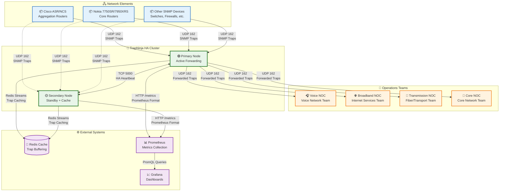
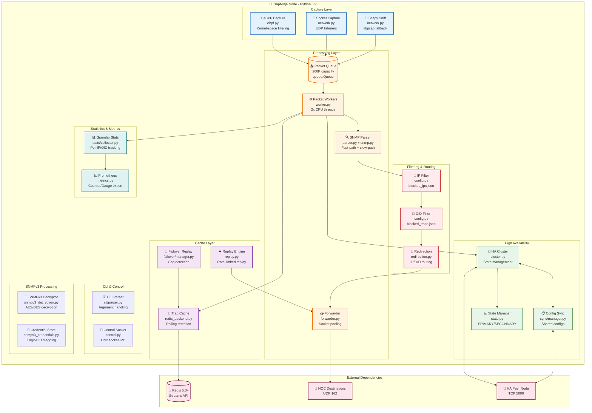
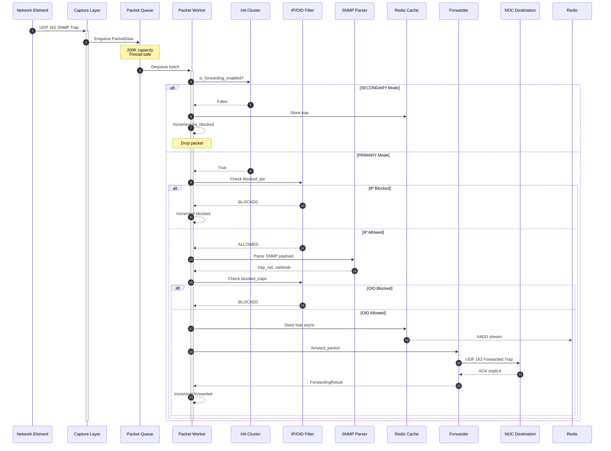
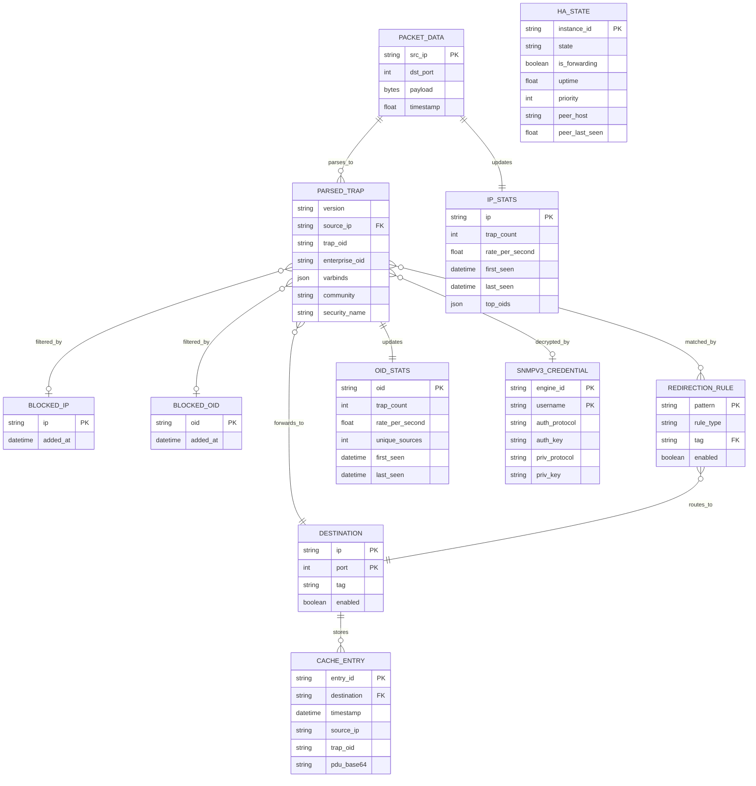
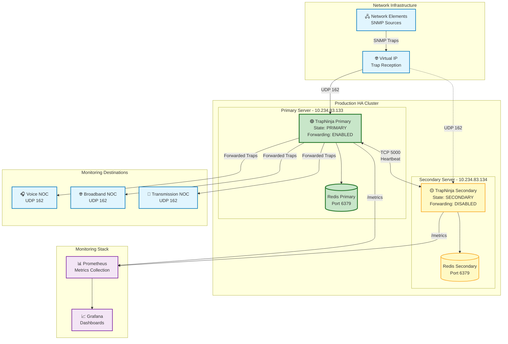

# TrapNinja Architecture Brief

**Version:** 0.7.13 (Beta)  
**Last Updated:** January 2, 2026  
**Document Type:** Architecture Brief

---

## Table of Contents

- [Overview](#overview)
- [Problem Definitions & Business Context](#problem-definitions--business-context)
- [C4 System Context Diagram](#c4-system-context-diagram)
- [System Overview](#system-overview)
  - [C4 Container Diagram](#c4-container-diagram)
  - [C4 Container Diagram Explanation](#c4-container-diagram-explanation)
  - [Request Flow Sequence](#request-flow-sequence)
  - [Technology Stack](#technology-stack)
- [System Data Models](#system-data-models)
  - [Data Model ER Diagram](#data-model-er-diagram)
- [API Endpoints](#api-endpoints)
  - [Core API Routes](#core-api-routes)
- [Deployment Architecture](#deployment-architecture)

---

## Overview

TrapNinja is a high-performance SNMP trap forwarding system designed for telecommunications environments requiring 99.999% availability. The system captures SNMP traps from multi-vendor network equipment and intelligently routes them to specialized Network Operations Centers (NOCs) based on configurable rules.

**Primary Users:** Network Operations Teams (Voice NOC, Broadband NOC, Transmission NOC, Core Network Team)

**Key Capabilities:**
- High-throughput packet processing (10,000+ traps/second sustained, 100,000+ burst)
- Primary/Secondary high-availability with sub-3-second automatic failover
- Service-based routing to specialized NOCs by IP or OID patterns
- Zero trap loss during monitoring system outages via Redis-based caching and replay
- SNMPv3 decryption and conversion to SNMPv2c
- Prometheus-compatible metrics for comprehensive monitoring

---

## Problem Definitions & Business Context

### Problem Statement

Telecommunications networks generate thousands of SNMP traps per second from diverse equipment including Cisco ASR/NCS routers and Nokia 7750SR/7950XRS systems. Traditional trap forwarding solutions lack the performance, resilience, and intelligent routing capabilities needed for modern carrier-grade operations. Specifically:

1. **Performance bottlenecks** during network events like fiber cuts cause trap floods of 10,000-100,000+ traps that overwhelm traditional forwarders
2. **Single points of failure** in trap forwarding paths result in missed alarms during critical network events
3. **Lack of intelligent routing** forces all NOC teams to receive all traps, creating alert fatigue
4. **Monitoring outages** cause permanent trap loss with no ability to backfill historical data
5. **SNMPv3 encrypted traps** cannot be processed by legacy monitoring systems

### Business Context

- **Primary Users:** Voice NOC, Broadband NOC, Transmission Team, Core Network Operations
- **Use Cases:**
  - Real-time forwarding of SNMP traps to multiple monitoring destinations
  - Service-based routing of traps to specialized NOC teams
  - Blocking noisy or irrelevant trap sources at the forwarder level
  - Replaying cached traps during monitoring system outages
  - Decrypting SNMPv3 traps for legacy monitoring system compatibility
- **Non-Functional Requirements:**
  - **Availability:** 99.999% uptime (5 nines) with automatic failover
  - **Performance:** 10,000+ traps/second sustained, 100,000+ burst handling
  - **Latency:** Sub-millisecond forwarding latency
  - **Scalability:** Horizontal scaling via additional HA pairs
  - **Security:** SNMPv3 decryption, credential management, no trap data persistence beyond cache window
- **Integration Points:** Network Elements (Cisco, Nokia, etc.), NOC Monitoring Systems, Prometheus/Grafana, Redis Cache

---

## C4 System Context Diagram

---

## System Overview

### C4 Container Diagram

### C4 Container Diagram Explanation

TrapNinja is implemented as a Python 3.9 application with modular architecture for maintainability and performance. The system is organized into distinct layers:

**Capture Layer:** Three capture methods with automatic fallback hierarchy. eBPF provides kernel-space filtering for maximum performance (30k+ traps/sec), Socket capture uses UDP listeners for standard operation (10k+ traps/sec), and Scapy Sniff provides libpcap-based fallback for compatibility (5k+ traps/sec). Only ONE capture method runs at a time to prevent packet duplication.

**Processing Layer:** A thread-safe queue with 200,000 packet capacity buffers incoming traps for processing by worker threads (2x CPU cores, up to 32). The SNMP parser implements a fast-path for SNMPv2c (direct byte scanning) and slow-path for SNMPv1/complex packets. The forwarder uses socket pooling for efficient connection reuse.

**Filtering & Routing Layer:** Configuration-driven filtering blocks unwanted IPs and OIDs. The redirection engine routes traps to specialized destinations based on source IP or trap OID patterns, enabling service-based routing to different NOC teams.

**High Availability Layer:** The HA Cluster manages PRIMARY/SECONDARY state with automatic failover. Config Sync ensures shared configurations remain synchronized between nodes. The state machine handles transitions with split-brain detection and resolution.

**Cache Layer:** Redis Streams-based trap caching with configurable retention (default 2 hours) enables replay during monitoring outages. The Failover Replay system automatically detects gaps during HA transitions and replays missed traps.

**Statistics & Metrics Layer:** Granular statistics track per-IP, per-OID, and per-destination metrics. Prometheus-format metrics are exported for integration with monitoring dashboards.

**SNMPv3 Layer:** Decryption engine handles AES/DES encrypted SNMPv3 traps, converting them to SNMPv2c for legacy system compatibility. Credential store manages engine ID to user mappings.

#### Request Flow Sequence

The following sequence diagram illustrates the critical use case of trap reception and forwarding:

### Technology Stack

**Runtime & Languages:**
- Python 3.9 (with `-O` optimization flag for production)
- Scapy 2.5+ (packet capture and parsing)
- BCC/eBPF (kernel-space packet acceleration on Linux 4.4+)

**Data Storage:**
- Redis 5.0.3+ (Streams API for trap caching)
- JSON files (configuration persistence)

**Infrastructure:**
- RHEL 8.x / CentOS 8 / Rocky Linux 8 (production OS)
- systemd (service management)
- Ansible (deployment automation)

**Networking:**
- Raw sockets (high-performance forwarding)
- UDP port 162 (SNMP trap reception)
- TCP port 5000 (HA heartbeat)

**Monitoring & Security:**
- Prometheus (metrics export)
- HMAC-SHA256 (HA message authentication)
- SNMPv3 AES/DES decryption (pysnmp, cryptography)

---

## System Data Models

### Data Model ER Diagram

**Data Flow Explanation:**

1. **PACKET_DATA** represents raw captured packets queued for processing
2. **PARSED_TRAP** contains extracted SNMP information after parsing
3. **DESTINATION** defines forwarding targets, loaded from `destinations.json`
4. **BLOCKED_IP/BLOCKED_OID** filter unwanted traffic at processing time
5. **REDIRECTION_RULE** maps IP/OID patterns to destination tags for service-based routing
6. **CACHE_ENTRY** stores traps in Redis Streams for replay capability
7. **HA_STATE** tracks cluster state for coordinated failover
8. **IP_STATS/OID_STATS** collect granular metrics for monitoring dashboards
9. **SNMPV3_CREDENTIAL** stores decryption credentials per engine ID

---

## API Endpoints

### Core API Routes

TrapNinja exposes functionality through a command-line interface (CLI) and Unix socket control interface for programmatic access.

**Daemon Control:**
- `--start` - Start TrapNinja service (daemonized)
- `--stop` - Stop TrapNinja service gracefully
- `--restart` - Restart TrapNinja service
- `--status` - Show service status, uptime, and basic metrics

**Filtering Commands:**
- `--block-ip <IP>` - Block source IP address
- `--unblock-ip <IP>` - Remove IP from block list
- `--list-blocked-ips` - Show all blocked IPs
- `--block-oid <OID>` - Block trap OID
- `--unblock-oid <OID>` - Remove OID from block list
- `--list-blocked-oids` - Show all blocked OIDs

**Statistics Commands:**
- `--stats-summary` - Show processing statistics summary
- `--stats-top-ips [N]` - Show top N source IPs by trap count
- `--stats-top-oids [N]` - Show top N OIDs by trap count
- `--stats-details <IP|OID>` - Show detailed stats for specific IP or OID

**High Availability Commands:**
- `--ha-status` - Show HA cluster status
- `--promote` - Manually promote to PRIMARY
- `--demote` - Manually demote to SECONDARY
- `--force-failover` - Force immediate failover
- `--config-sync-status` - Show configuration sync status
- `--config-sync` - Trigger manual config synchronization

**Cache Commands:**
- `--cache-status` - Show cache connection and statistics
- `--cache-query <destination> --start <time> --end <time>` - Query cached traps
- `--cache-replay <destination> --start <time> --end <time>` - Replay cached traps
- `--cache-clear [destination]` - Clear cache entries

**SNMPv3 Commands:**
- `--snmpv3-add-user` - Add SNMPv3 credentials
- `--snmpv3-list-users` - List configured SNMPv3 users
- `--snmpv3-remove-user <engine_id> <username>` - Remove SNMPv3 credentials

**Prometheus Metrics Endpoint:**
- `GET /metrics` - Prometheus-format metrics export (HTTP)

Key metrics exposed:
| Metric | Type | Description |
|--------|------|-------------|
| `trapninja_traps_received_total` | Counter | Total traps received |
| `trapninja_traps_forwarded_total` | Counter | Total traps forwarded |
| `trapninja_traps_blocked_total` | Counter | Total traps blocked |
| `trapninja_traps_redirected_total` | Counter | Total traps redirected |
| `trapninja_queue_depth` | Gauge | Current packet queue depth |
| `trapninja_ha_state` | Gauge | HA state (1=PRIMARY, 2=SECONDARY) |
| `trapninja_ha_forwarding` | Gauge | Forwarding enabled (1=yes, 0=no) |

---

## Deployment Architecture

**Deployment Specifications:**

| Component | Primary Server | Secondary Server |
|-----------|---------------|------------------|
| IP Address | 10.234.83.133 | 10.234.83.134 |
| HA Priority | 150 (higher) | 100 (lower) |
| HA Mode | primary | secondary |
| Redis | localhost:6379 | localhost:6379 |
| Cache Retention | 2 hours | 2 hours |

**System Requirements:**

| Resource | Minimum | Recommended |
|----------|---------|-------------|
| CPU | 4 cores | 8+ cores |
| Memory | 2 GB | 4+ GB |
| Disk | 10 GB | 50+ GB (for cache) |
| Network | 1 Gbps | 10 Gbps |
| OS | RHEL 8.x | RHEL 8.10 |
| Python | 3.9+ | 3.9 with -O flag |

**Performance Characteristics:**

| Metric | Target | Achieved |
|--------|--------|----------|
| Throughput (eBPF) | 30,000/s | 30,000+/s |
| Throughput (Socket) | 10,000/s | 10,000+/s |
| Queue Capacity | 200,000 | 200,000 |
| Failover Time | <5s | 3-4s typical |
| Memory (steady) | <500 MB | 100-300 MB |
| CPU (at 10k/s) | <50% | 20-40% |

---

**Document Revision History:**

| Version | Date | Author | Changes |
|---------|------|--------|---------|
| 0.7.13 | 2026-01-02 | TrapNinja Team | Initial architecture brief |
