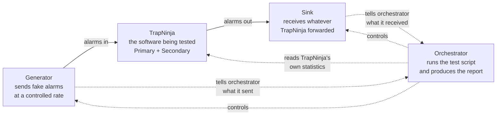

# TrapDojo — Overview

**Audience:** anyone who needs to understand what TrapDojo is and why it exists — NOC operations leads, programme sponsors, security reviewers, auditors, or engineers new to the project. Written to be read in ten minutes. No code, no jargon.

**Related docs (for engineers):**
[High-Level Design](HighLevel-TestRig.md) · [Low-Level Design](LowLevel-TestRig.md)

---

## Why this exists

The network operations centre (NOC) receives alarms from thousands of network devices. Those alarms travel as **SNMP traps** — small UDP messages — through a piece of software called **TrapNinja**, which forwards them to the right NOC team.

If a fibre cable is cut somewhere in the network, TrapNinja might see **100,000 alarms in a few seconds**. If it drops even one, the NOC misses an alarm. If it drops the wrong one, an outage lasts longer than it should. TrapNinja claims it can handle this without losing anything — but a claim is not proof.

**TrapDojo is the tool that turns that claim into evidence.** It generates realistic alarm floods, watches exactly what TrapNinja delivers, and produces a signed report saying either "TrapNinja handled it" or "TrapNinja failed here, at this rate, in this way".

---

## What TrapDojo does — in one paragraph

TrapDojo is a **load-testing rig** for TrapNinja. It has three parts running on three separate machines. A **generator** produces a controlled flood of SNMP traps aimed at TrapNinja. A **sink** receives whatever TrapNinja forwards on the other side and counts what actually arrived. An **orchestrator** runs the whole experiment from a script, collects TrapNinja's internal statistics, and produces a report. TrapDojo never touches the TrapNinja servers themselves — it treats TrapNinja as a black box, exactly as a real network device would.

---

## The picture

The generator knows exactly what it sent. The sink knows exactly what arrived. TrapNinja's own internal counters explain what happened in between. TrapDojo puts all three together and produces a verdict.

---

## What we can prove with it

Each of these is a **scenario** — a scripted test with a defined pass/fail condition.

| Scenario | What it proves |
|---|---|
| Baseline | The test rig itself works — 1,000 alarms per second for 10 minutes, zero loss. |
| Ramp to failure | The maximum sustained alarm rate TrapNinja handles without dropping anything — and *which* stage inside TrapNinja fails first when we push past it. |
| Fibre-cut burst | TrapNinja can absorb a sudden spike of 100,000 alarms in 30 seconds and drain the backlog cleanly. |
| Sustained soak | TrapNinja is stable for 8–24 hours at 80% of the sustained maximum — no memory leaks, no counter drift. |
| Filter-heavy | TrapNinja's rules for routing alarms to the right NOC teams work correctly under load. |
| HA failover | When one TrapNinja node fails, the other takes over in under 3 seconds without losing alarms. |
| Redis outage | TrapNinja keeps forwarding alarms even when its Redis cache is unavailable. |
| Many sources | TrapNinja copes when alarms come from 50,000+ distinct network devices, not just a handful. |

Every scenario produces a report card. Every report card is comparable to previous runs, so a change to TrapNinja that quietly makes things worse gets caught.

---

## What a run looks like

A typical run of the "ramp to failure" scenario:

1. **Preparation.** The orchestrator checks all three machines are healthy, confirms clock synchronisation, records the exact TrapNinja version and configuration, and refuses to start if anything looks wrong.
2. **Warm-up.** Alarms flow at a low rate for 30 seconds. Numbers from this phase are discarded — it's just to reach a steady state.
3. **Measurement.** The rate steps up every 60 seconds — 5k alarms/sec, then 10k, then 15k, and so on. At each step the orchestrator checks whether TrapNinja is keeping up.
4. **Detection.** At some rate, TrapNinja begins to struggle: alarms start queuing up, or a small number are dropped. The orchestrator recognises this and stops pushing.
5. **Settlement.** The generator stops. The orchestrator waits for any in-flight alarms to arrive at the sink before declaring anything lost.
6. **Report.** A JSON file and a human-readable markdown summary are written. The summary names the exact rate where TrapNinja began to fail, the stage it failed at, and any evidence gaps.

Total time: usually 15–30 minutes for a ramp scenario, 8–24 hours for a soak.

---

## What "the run passed" actually means

Every run ends in one of four verdicts. This distinction is important — most naive test tools only report pass or fail.

| Verdict | Meaning | Example |
|---|---|---|
| **PASS** | Everything TrapDojo could measure was within acceptable limits. TrapNinja handled the load. | Ramp reached 50k alarms/sec with zero loss and returned to baseline within budget. |
| **FAIL** | The evidence is complete and TrapNinja fell short. | At 45k alarms/sec, 0.5% of alarms did not arrive at the destination they should have. |
| **INVALID** | Something in the test rig or lab environment prevented a clean measurement. **This is not a TrapNinja failure.** | The sink's own kernel buffer overflowed, so we cannot tell whether the missing alarms were TrapNinja's fault. |
| **ABORTED** | The run stopped before enough evidence was collected. | A machine crashed, the operator pressed Ctrl-C, or the SUT became unreachable. |

Every verdict also carries a **scope** telling us whose problem it is: `sut` (TrapNinja), `rig` (TrapDojo), `environment` (the lab), or `evidence` (something we couldn't measure). Rig or environment problems never masquerade as TrapNinja failures.

---

## What we need from the lab

To run TrapDojo you need:

- **Three or four dedicated machines**, on the same fast network as TrapNinja, but **never on the TrapNinja machines themselves** — running the test on the same host would contaminate the measurement.
- **A ≥ 1 Gbps switch** between the generator and TrapNinja. Even a 100k-alarms-per-second flood is only about 160 Mbps, but headroom matters.
- **`chronyd` running** on every host for accurate time. (This is standard on the lab servers already.)
- **SSH access** from the orchestrator machine to the TrapNinja servers, using a locked-down account that can only run a small whitelist of commands.
- **A signed copy of the TrapDojo container image**, delivered through the normal air-gap process.

There is nothing to install on the TrapNinja servers themselves.

---

## What's safe and what isn't

TrapDojo can be very disruptive if pointed at the wrong thing. The design makes accidents structurally hard:

- **Every target IP is checked** against an inventory of lab machines. You cannot accidentally aim a 100,000-alarm-per-second flood at a production TrapNinja by mis-typing an IP address.
- **Disruptive tests are opt-in.** A scenario that stops the primary TrapNinja to test failover must explicitly declare `destructive: true` and match a lab allowlist. A missing acknowledgement means the run refuses to start.
- **Spoofed source addresses require acknowledgement.** Sending traffic that pretends to come from thousands of network devices is powerful but risky if the lab network isn't configured for it — the scenario must explicitly enable this.
- **Malformed traffic requires acknowledgement.** Deliberately sending broken alarms to test TrapNinja's error handling is opt-in.
- **Dry-run mode.** Before any real run, the orchestrator can print exactly what it will do, on which machines, without executing anything.
- **No production access.** TrapDojo cannot reach production TrapNinja instances because the inventory of allowed targets is scoped to lab hosts.

The rig is designed on the principle that the worst thing that can happen is "the lab TrapNinja fell over and someone needs to restart it". Anything worse than that is a bug in TrapDojo and gets treated accordingly.

---

## Timeline

TrapDojo is being built in staged phases. Each phase produces a working slice.

| Phase | What is delivered | Purpose |
|---|---|---|
| **R0** | Wire format and accounting engine, verified with synthetic tests | Prove the maths is right before we build the moving parts. |
| **R1** | Generator + sink + self-check | Prove the rig can generate and receive traffic accurately in a closed loop. |
| **R2** | Orchestrator + reporter, run against real TrapNinja | Produce the first defensible breaking-point report for TrapNinja. |
| **R3** | Bursts, spoofed sources, malformed traffic, multi-destination routing | Cover the full realistic test matrix. |
| **R4** | Failover and Redis outage scenarios | Test the highest-risk claims (5-nines availability, sub-3-second failover). |
| **R5** | SNMPv3 encryption support and cross-version comparison reports | Test the encrypted-traffic path and enable regression comparisons across TrapNinja releases. |

Time estimates for each phase are tracked in the programme plan, not this document — this document intentionally does not go stale when the plan slips.

---

## Where to go for more detail

- **Design decisions and rationale:** [HighLevel-TestRig.md](HighLevel-TestRig.md) — how the system is put together and why.
- **Implementation specification:** [LowLevel-TestRig.md](LowLevel-TestRig.md) — the byte-level, line-of-code detail engineers work against.
- **Prerequisites TrapNinja must ship:** covered in the [TrapNinja-Side Requirements section of the HLD](HighLevel-TestRig.md#trapninja-side-requirements). Three small additions to TrapNinja must be in place before R2 begins.

---

## Glossary

Everyday-language definitions. For the precise engineering meanings see the [HLD Terminology section](HighLevel-TestRig.md#terminology).

| Term | Meaning |
|---|---|
| **Trap** | An SNMP trap — a small UDP message a network device sends when something notable happens (a link goes down, a temperature threshold is crossed, etc.). |
| **TrapNinja** | The software being tested. It receives traps from network devices and forwards them to NOC monitoring systems. |
| **TrapDojo** | The test rig. It generates traps, receives what TrapNinja forwards, and produces a report. |
| **SUT** | System Under Test — jargon for "the thing being tested". In our case, TrapNinja. |
| **NOC** | Network Operations Centre — the team (and monitoring system) that receives forwarded alarms and acts on them. |
| **Generator** | The TrapDojo component that produces the alarm flood. |
| **Sink** | The TrapDojo component that receives the forwarded alarms and counts them. |
| **Orchestrator** | The TrapDojo component that runs the test script and produces the report. |
| **Scenario** | A named, scripted test with a defined pass/fail condition (for example, "ramp-to-failure" or "fibre-cut-burst"). |
| **Ramp** | A test that increases the alarm rate step by step until something fails, to find the maximum sustained rate. |
| **Burst** | A test with a short spike of alarms (30–60 seconds) followed by recovery, to prove TrapNinja can absorb sudden events. |
| **HA failover** | High Availability failover — when one TrapNinja node fails, the other takes over. TrapDojo tests that this happens fast enough and without losing alarms. |
| **Verdict** | The result of a run: PASS, FAIL, INVALID, or ABORTED (see [above](#what-the-run-passed-actually-means)). |
| **Air-gap** | The lab network is not connected to the internet. All software arrives on signed media through a controlled process. |

---

*If any of this is unclear, that's a bug in the document — please raise it. The purpose of this page is to answer "what is being built and why" without requiring anyone to read the engineering specs first.*
